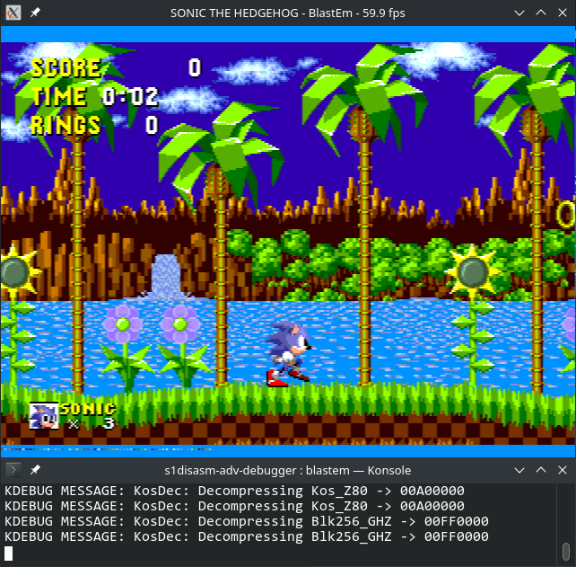
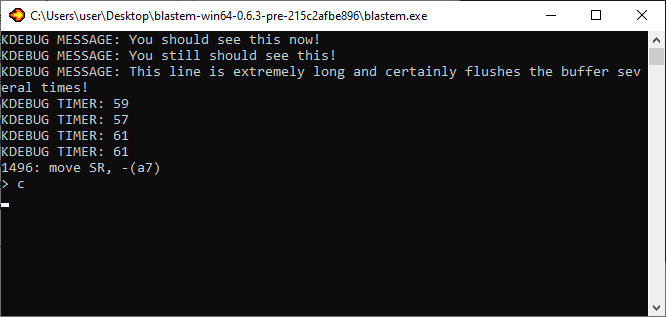
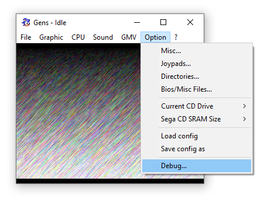
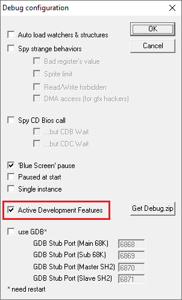
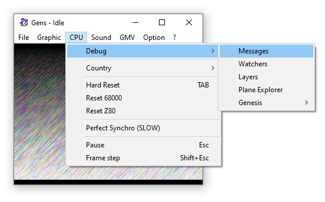

# Using KDebug integration in MD Debugger



"KDebug" integration works in DEBUG builds and allows you to log messages, count cycles and break point in emulators that support it.

Currently, the only emulators that support KDebug are:
- Blastem-nightly;
- Gens KMod (outdated, not recommended).

Since Gens KMod is heavily out of date and Windows-only, **using Blastem-nightly is recommended instead.**

This guide briefly shows you how to set up both emulators to work with KDebug.

## Adding logging in your game

Before we actually set up one of the supported emulators, we need to actually make use of "KDebug" integration in the code, so we have something to tests.

The most commonly used (and overall useful) function is `KDebug.WriteLine`, which logs a formatted string to emulator's own console/window.

You can put the following anywhere in your code. Just make sure this code is reached when you test it:

```m68k
	KDebug.WriteLine "Hello, world!"
```

For a sligthly more practical example, you may also check "Log in-game events with `KDebug`" section of [Debugging Techniques](Debugging_techniques.md) guide.

For a full reference of the available `KDebug` macros, see the [Macros Reference](../Debug_macros.md).

## Setting up Blastem-nightly (recommended)

A newer, not yet officially released versions of Blastem support KDebug integration. They are still available as nightly builds, hence I use the name Blastem-nightly.

You can find all nightly builds here: https://www.retrodev.com/blastem/nightlies/. **But you need only the latest of them!** Find Blastem version 0.6.3-pre for your platform that was build recently.

At the time of writing, the following versions were-up-to date:
- Windows 64-bit: https://www.retrodev.com/blastem/nightlies/blastem-win64-0.6.3-pre-215c2afbe896.zip
- Linux 64-bit: https://www.retrodev.com/blastem/nightlies/blastem64-0.6.3-pre-215c2afbe896.tar.gz

### Viewing debug messages on Windows

On Windows, you cannot easily toggle emulators console out of the box (at least at the time of writing), but there's a workaround for it.

1. Start you ROM in Blastem-nightly;
2. Press the `u` key to pause the game and toggle debugger;
3. You should now emulator's console and all the messages up to this point;
4. Since you've paused the game by toggling the debugger, type `c` in the console and press `Enter` to continue;
5. The emulator's console will still be open in a separate window and you should now see debug messages properly.

   

### Viewing debug messages on Linux

Viewing messages on Linux is easy and straightforward: just launch the emulator from terminal, you'll see its output.

1. Open Terminal and type in path to the `blastem` executable (you may add it to your `PATH` for easier access);
2. You will see debug messages in the very same terminal.

## Setting up Gens KMod (not recommended)

> **Warning**
> 
> Kens KMod is a heavily outdated and inaccurate emulator. **Using it is not recommended.**

1. Start the emulator and enable debugging: "Option" > "Debug..." > "Active Development Features".

   

   

2. Open "CPU" > "Debug" > "Messages" to see the logs.

   
