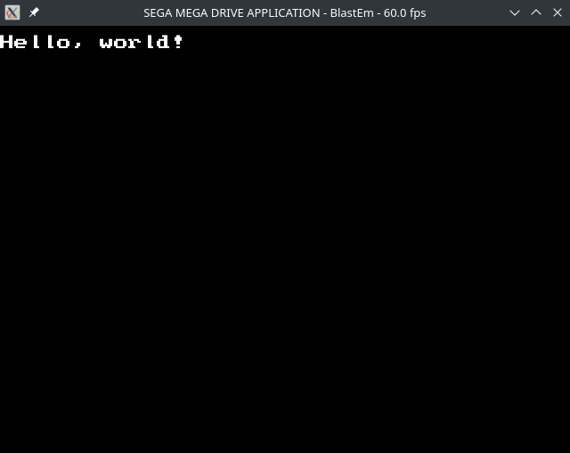

# MD Shell

**MD Shell** is a stand-alone easy to use "assembly header" for creating small console-based programs on Sega Mega-Drive / Genesis. It provides minimal but robust run-time environment with the ROM header, entry point and "high-level" macros for printing formatted text.

MD Shell can be used for quickly sketching test ROMs or learning M68K assembly in a friendly environment with accessible debug printing (without side-effects). It has all the features of MD Debugger and Error Handler built-in.

## Simple Hello World



Once you include `MDShell.asm` header/object, you can write a simple console program in 3 lines of code:

```
	include "MDShell.asm"

Main:
	Console.WriteLine "Hello, world!"
	rts
```

Each program should define "Main:" as an entry point.

Anywhere in your code you can access `Console` and `KDebug` objects and call `RaiseError`. For full reference on macros and formatted strings, see "Documentation" section below.

## Building from source code

Please refer to [BUILD.md](BUILD.md) for build instructions.

## Bundles and supported assemblers

**MD Shell** provides several flavors of headers/objects dubbed "bundles" (similarly to MD Debugger) that target various popular 68K assemblers. Currently, the following bundles are provided:

* `asm68k` (recommended) - a complete header with blob targetting the _ASM68K assembler_;
* `asm68k-linkable` - header and an object file for the _ASM68K assembler_, for use with advanced build systems where _Psy-Q Linker_ is required;
* `as` - a complete header with blob targetting the _AS Macroassembler_ (v.1.42 Bld 55 and above);
* `headless` - blob-only version, that should be compatible with any ASM68K assembler; it's mostly useless since macros aren't included.

> [!WARNING]
>
> The AS Macroassembler version has limited support for some features!

## Documentation

- [Macros reference](docs/Macros_reference.md)
- [Formatted string format reference](docs/Formatted_strings.md)

## Version history

### Version 2.6 (2024-12-15)

- Introduce new `asm68k-linkable` bundle which targets Psy-Q Linker;
- Add support for `KDebug` integration with the following new macros:
  - `KDebug.WriteLine`
  - `KDebug.Write`
  - `KDebug.BreakLine`
  - `KDebug.BreakPoint`
  - `KDebug.StartTimer`
  - `KDebug.EndTimer`
- Error handler now uses compact offsets and symbol displacements: offsets are rendered as 24-bit instead of 32-bit (because M68K has a 24-bit bus anyways), and displacements don't have leading zeros (`+000X` is now `+X`);
- Improved assertions (`assert` macro):
  - You can now assign a debugger to use when assetion fails, e.g. `assert.w d0, eq, #$1234, MyDebuggerIfItFails`;
  - Save/restore CCR in `assert` macro, so conditional flags aren't affected by it (this was already done in other macros);
  - Assertion failed exception now displays the original source code line and the received value;
- Error handler now also recognizes dynamic VInt/HInt jump handlers if they use `jmp (xxx).w` opcode instead of `jmp (xxx).l`;
- Performance of `Console.WriteLine`, `Console.Write`, `KDebug.WriteLine`, `KDebug.Write` is now much faster when formatted string doesn't include any printable arguments;
- Support user-defined `VBlank` and `HBlank` interrupt handlers (`asm68k` and `as` bundles only);
- Intoduce `_Console.*`, `_KDebug.*`, `_assert` macros ("shadow macros"): they behave like the original ones, but don't save/restore CCR; advanced users may take advantage of them for minor optimizations;
- `Console.WriteLine` and `Console.Write` now always restore last VRAM write location and won't break if your code writes to other VRAM locations in-between them;
- **AS version:** Support `xxx.w`, `(xxx).w`, `xxx.l` and `(xxx).l` syntax in formatted string arguments;
- **AS version:** Support missing `vc`, `vs` (overflow set/clear) conditions in `assert` macro (it was already supported in ASM68K version);
- **ASM68K version:** Fully support projects using "." instead of "@" for local labels (previously debugging macros could break local label scopes);
- **ASM68K version:** Support projects compiled with `/o ae+` option (it could previously caused issues when storing formatted strings);
- **ASM68K version:** Don't allow `X(sp)`, `-(sp)`, `(sp)+` in formatted strings (e.g. `"%<.w 4(sp) sym>"`); it was already unsupported in AS version, because this can lead to unexpceted results or crashes;
- **ASM68K version:** Warn if project `/o ws+` is not set as it breaks most of the debugger macros;
- **ASM68K version:** Replace `endc` directives with `endif` for readability;
- **ASM68K-Linkable version:** place strings of debugger macros (`.Write`, `.WriteLine`, `RaiseError` etc) in a separate section instead of inlining them, making generated code much smaller;
- Replace `__global__*` prefix for exported labels with `MDDBG__*`;
- Make console detection in `Console.*` macros much safer; they previously read a magic byte `Console.Magic(usp)` to tell if `usp` pointed to valid Console data, but it could crash when reading from invalid memory; magic byte is now stored in MSB of `usp` to mark pointer itself valid;
- Use larger text buffer for all `.WriteLine` and `.Write` calls (this reduces number of flushes and improves performance);
- Upgraded ConvSym from version 2.9.1 to 2.12.1, which adds the following major improvements:
  - Fixed a rare symbol encoding issue where data with unusual entropy would produce long prefix trees with some codes exceeding 16-bits, corrupting a small set of symbol texts;
  - Fixed another rare symbol encoding bug where if symbol heap for a memory block exceeds 64 KB and stops accepting symbols, all symbols in further blocks are also discarded;
  - Added new `txt` input parser for parsing generic text files using a configurable format string (this allows to parse SGDK's `symbol.txt` file);
  - Added support for symbol references instead of raw offsets in `-ref` and `-org` options (e.g. `-ref @MySymbol`);
  - Added `-addprefix` option to prefix all output symbols with a given string;
- **Bugfix:** Fix `%<palN>` flags clearing priority and XY-flip bits of Console's base pattern on top of changing palette bits;
- **Bugfix:** Fix a bug introduced in v.2.5 where "VInt:", "HInt:" couldn't properly render `<undefined>` text if VInt or HInt handlers were dynamic (in RAM), but their target locations weren't understood.
- **Bugfix:** Fix a rare buffer over-read in `Console.Write[Line]` and `KDebug.Write[Line]` and other macros using formatting strings if buffer flush occurs exactly in the middle of multi-byte formatting flag (e.g. `setw,40`);
- General optimizations and stability improvements.

### Version 2.5

- **ASM68K version:** Support "case-sensitive" compile-flag;
- **AS version:** Most of the M68K addressing modes are now supported in formatted strings. The following examples now work:
  - `%<.w #1234>`
  - `%<.w #SomeSymbolAsValue>`
  - `%<.l $FF0000>`
  - `%<.b 1(a0)>`
  - `%<.b something(a0)>`
  - `%<.b SomeLabel(pc)>`
- **AS version:** Add a workaround for an assembler bug in older builds of AS which may cause some instructions to be misaligned;
- **AS version:** Macro invocations (`Console.*`, `RaiseError`) no longer break local labels if placed in-between them;
- **AS version:** Prefer `!align` instead of `align` to avoid issues if it's overridden in the project;
- **AS version:** Support "case-sensitive" compile flag;
- Fixed a rare case of buffer overflow when displaying offset as a symbol with displacement;
- Added `assert` macro.
- Added additional `Console.*` macros:
  - `Console.Clear`
  - `Console.Pause`
  - `Console.Sleep`
  - Major MD Debugger improvements:
  - Introduced debugger extensions and the following new built-in debuggers:
    - Backtrace debugger (mapped to the B button by default);
    - Address register debugger (mapped to the A button by default).
  - Support full address range for stack pointer (previous version only correctly worked with $FF8000-$FFFFFF range due to optimizations);
  - Improve readability of offsets and symbols in the exception header;
  - Renamed "Module:" field in exception header to "Offset:" for clarity;
- Upgraded ConvSym from version 2.0 to 2.9.1. This adds the following major features for debug symbol generation:
  - Stable AS support;
  - Improve symbol data compression by force-converting your symbols to upper or lowecase;
  - Support for multiple labels on the same offset;
  - Support for symbols in RAM section (must be properly implemented in your project);
  - Advanced offset transformations: mask, upper/bottom boundary, add/subtract base address;
- Code-size optimizations, minor bugfixes and stability improvements;

### Version 2.0

The initial version 2.x release
